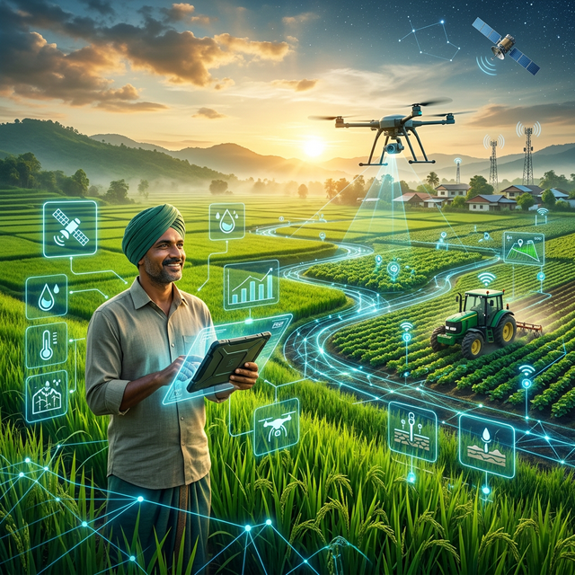
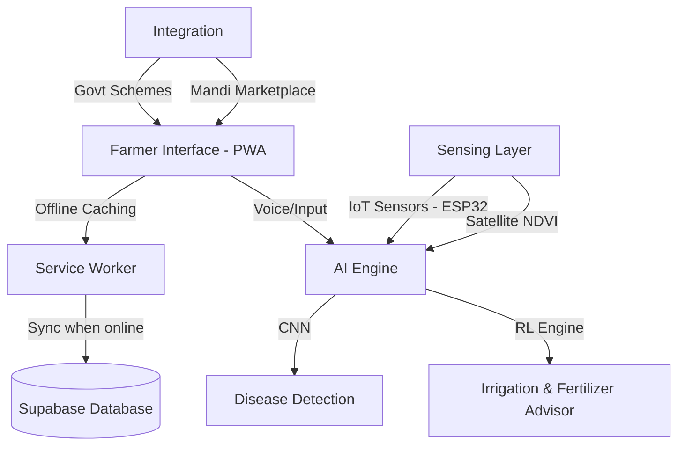

# 🌾 Annadata Saathi (अन्नदाता साथी)
## *Empowering the Hands That Feed Us with AI & Remote Sensing*

[](https://unstop.com/conferences/india-innovates-2026-municipal-corporation-of-delhi-1625920)
[](https://unstop.com/conferences/india-innovates-2026-municipal-corporation-of-delhi-1625920)

---



## 📌 Project Overview
**Annadata Saathi** is an AI-powered, **offline-first** smart farming assistant prototype designed to support small and marginal farmers in low-connectivity rural environments. It bridges the digital divide by transforming complex satellite data and environmental insights into actionable guidance, helping farmers improve productivity, sustainability, and transparency.

Developed as a **Progressive Web App (PWA)**, the platform ensures that critical agricultural intelligence is accessible even without a continuous internet connection, using multilingual voice interaction to reach farmers across all literacy levels.

---

## 🛑 The Challenge
Small and marginal farmers face a "triple threat" of uncertainty:
1.  **Environmental Vulnerability**: Unpredictable weather and inefficient resource usage.
2.  **Information Inaccessibility**: Delayed detection of crop diseases and lack of real-time market/mandi prices.
3.  **Digital Divide**: Limited internet connectivity in rural areas and complex interfaces for government schemes.

---

## 💡 Our Solution: The AI-Driven Ecosystem
Annadata Saathi integrates multiple cutting-edge technologies into a single farmer-centric interface:

### 🛰️ 1. Remote Sensing (NDVI Monitoring)
- **Early stressed detection**: Uses satellite-based Normalized Difference Vegetation Index (NDVI) to identify crop health issues before they become visible to the naked eye.
- **Cost-Effective**: No drones or expensive hardware required; relies on open satellite data.

### 🤖 2. Precision Advisory with RL
- **Intelligent Recommendations**: A reinforcement learning-inspired engine that optimizes irrigation and fertilizer usage based on soil sensors (pH, NPK, Moisture) and local weather forecasts.
- **Sustainability**: Reduces resource wastage and lowers environmental impact.

### 🍃 3. Computer Vision (Disease Detection)
- **Instant Diagnosis**: A lightweight CNN-based vision module that identifies crop diseases from simple smartphone leaf images.
- **Actionable Treatment**: Providing immediate steps to mitigate crop loss.

### 🏛️ 4. Government & Market Integration
- **Scheme Navigator**: AI-guided discovery of relevant agricultural schemes, eligibility checking, and digital record maintenance.
- **Transparent Marketplace**: Direct access to mandi prices and a supply-chain transparency module for better profit margins.

---

## 🛠️ Technology Stack
| Layer | Technologies |
| :--- | :--- |
| **Frontend UI** | React.js, Next.js, Framer Motion, GSAP, Tailwind CSS |
| **PWA & Offline** | Vite-PWA, Service Workers (Offline Caching) |
| **Backend API** | FastAPI (Python), Node.js (Express) |
| **AI / ML** | TensorFlow, PyTorch, Scikit-learn, Computer Vision (CNN) |
| **Remote Sensing** | Satellite NDVI APIs, OpenWeatherMap API |
| **Database & Auth** | PostgreSQL, Supabase, Face-API.js (Face Auth) |
| **IoT Connectivity** | ESP32 (Real-time soil sensor integration demo) |
| **Voice Interface** | Multilingual Speech-to-Text & Text-to-Speech |

---

## 🏗️ System Architecture


---

## 🚀 Getting Started

### Prerequisites
- Node.js (v18+)
- Python 3.10+ (for backend/AI modules)
- Git

### Installation
1. **Clone the repository**
   ```bash
   git clone https://github.com/DHRUV-SAVE21/InnovatesIndia.git
   cd InnovatesIndia
   ```

2. **Frontend Setup**
   ```bash
   cd frontend
   npm install
   npm run dev
   ```
   *Visit `http://localhost:5173` locally.*

3. **Backend Setup** (Optional for full functionality)
   ```bash
   cd backend
   pip install -r requirements.txt
   python main.py
   ```

---

## 🏆 India Innovates 2026
This prototype is submitted to the **India Innovates 2026** Hackathon organized by the **Municipal Corporation of Delhi (MCD)** and **Delhi Ministry of Education**. Our mission aligns with the national goal of empowering the agricultural sector through digital transformation and indigenous innovation.

**Team Lead**: Dhruv 
**Project**: Annadata Saathi - Smart Agri-Tech Ecosystem

---
*Made with ❤️ for the Indian Farmer.*
