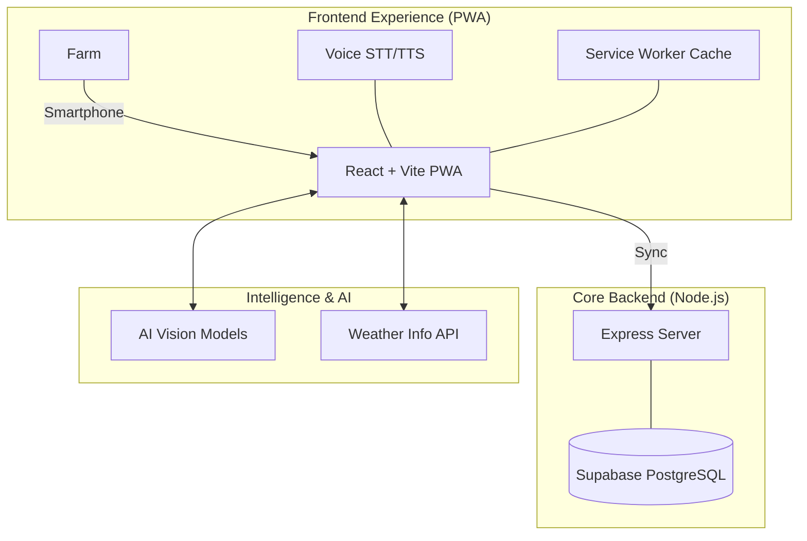

# 🌾 Annadata Saathi (अन्नदाता साथी)
## *Empowering the Hands That Feed Us with AI & Remote Sensing*

---


## 📌 Project Resources
- **📁 [Project Drive Link (Assets & Info)](https://drive.google.com/drive/folders/1621AS4paJHEzM6xfE4wstdHwvK2Dqyc0?usp=drive_link)**

---

## 📌 Project Overview
**Annadata Saathi** is an AI-powered, **offline-first** smart farming assistant prototype designed to support small and marginal farmers in low-connectivity rural environments. It bridges the digital divide by transforming complex agricultural data into actionable guidance, helping farmers improve productivity, sustainability, and transparency.

Our platform heavily revolves around the **Frontend Progressive Web App (PWA)**, which ensures that critical agricultural intelligence is accessible even without a continuous internet connection. Built directly alongside the frontend, our robust **Node.js & Supabase Backend** gracefully synchronizes offline actions, handles authentication, and maintains data integrity.

---

## 🛑 The Challenge
Small and marginal farmers face a "triple threat" of uncertainty:
1. **Environmental Vulnerability**: Unpredictable weather and inefficient resource usage.
2. **Information Inaccessibility**: Delayed detection of crop diseases and lack of real-time market/mandi prices.
3. **Digital Divide**: Limited internet connectivity in rural areas and complex interfaces for government schemes.

---

## 💡 Our Solution: A Frontend-Driven Ecosystem
Annadata Saathi integrates multiple cutting-edge technologies with a seamless frontend focus supported by a robust backend.

### 📱 1. Offline-First Frontend (The Core Experience)
- **Built with React & Vite**: A lightning-fast, progressive web application capable of storing data locally so farmers don't need a steady internet connection.
- **Stunning UI/UX**: Utilizes **Tailwind CSS**, **Framer Motion**, and **GSAP** for highly interactive, fluid, and intuitive interfaces.
- **Multilingual Support & Voice Access**: Reaches farmers across varying literacy levels using embedded text-to-speech and speech-to-text features.

### ⚙️ 2. Node.js & Supabase Backend (Intelligence & Sync)
- **Seamless Integration**: A lightweight Node.js Express server runs alongside the frontend to handle critical operations securely.
- **Data Synchronization**: Synchronizes cached offline data with **Supabase**, establishing a reliable architecture for saving user profiles, farming histories, and scheme progress.
- **Face Authentication**: Secure biometric authentication directly managed via the unified application structure.

### 🌾 3. AI & Remote Sensing Integrations
- **Intelligent Recommendations**: Connects to weather APIs and AI models to provide precise irrigation and fertilizer counseling.
- **Disease & Health Monitoring**: Processes leaf imagery and remote sensing data to determine plant health anomalies.
### 🚀 4. 10+ Integrated Smart Features
Our frontend houses a multitude of functionally diverse components and pages designed to cover every aspect of the agricultural lifecycle:

1.  **AI Crop Health & Disease Detection** (`CropHealth`, `DecisionIntelligence.jsx` components): Upload leaf images to our Computer Vision model to instantly identify diseases and get treatment recommendations.
2.  **IoT Sensor Dashboard** (`FarmerDashboard`, `ModernFarmerDashboard` JSX pages): Real-time field telemetry for Soil Moisture, Temperature, and NPK levels integrating Multi-Signal IoT Cores. Includes live Air/Gas monitoring and Fire detection.
3.  **Smart Irrigation Controls**: Automated watering recommendations based on real-time soil data and predictive weather models.
4.  **Farm Vault / Smart Inventory** (`FarmerInventory.jsx`): Manage harvested agricultural assets securely using Blockchain-backed Digital Passports with unique Scannable QR Codes.
5.  **Market Intelligence & Direct Marketplace** (`ModernMarketplace.jsx`): Direct-from-farm marketplace connecting farmers to buyers with live mandi prices and yield tracking.
6.  **Government Schemes & AI Assistant** (`SchemesPage`, `SchemesAgent.jsx`): An intelligent conversational agent ("Kisan Sahayak") that helps farmers find, understand, and apply for relevant government subsidies.
7.  **Equipment Analyzer** (`EquipmentAnalyzer.jsx`): Machine vision to assess farm equipment (like tractors), track maintenance schedules, suggest repairs, and locate nearby mechanic shops.
8.  **Blockchain Supply Chain Tracking** (`ProductTransparency.jsx`): End-to-end event traceability (logging SENSOR_READING and IRRIGATION events) for buyers, guaranteeing product origin.
9.  **Hyperlocal Weather & Disaster Alerts**: Micro-climate tracking and localized weather integrations to plan optimal harvest windows.
10. **Crop Recommendation & Yield Prediction**: AI-powered advisory to determine the most profitable crops to plant based on soil composition parameters.
11. **Face Authentication** (`FaceAuth.jsx`): Secure and simple biometric login using Face-API.js, eliminating password struggles for less digitally literate users.

---

## 🏗️ System Architecture


---

## 🛠️ Technology Stack
| Layer | Technologies |
| :--- | :--- |
| **Frontend UI** | React.js, Vite, Framer Motion, GSAP, Tailwind CSS |
| **PWA & Offline** | Vite-PWA, Service Workers (Offline Caching) |
| **Backend API** | Node.js (Express), integrated in the frontend repository |
| **Database & Auth** | PostgreSQL, Supabase, Face-API.js (Face Auth) |
| **Others** | OpenWeatherMap API, LangChain |

---

## 🚀 Getting Started

### Prerequisites
- Node.js (v18+)
- Postgres/Supabase configured (check `.env`)
- Git

### Installation
1. **Clone the repository**
   ```bash
   git clone https://github.com/DHRUV-SAVE21/InnovatesIndia.git
   cd InnovatesIndia
   ```

2. **Frontend Setup & Start**
   The React frontend and Node.js server reside inside the `frontend` folder.
   ```bash
   cd frontend
   npm install
   npm run dev
   ```
   *Visit `http://localhost:5173` locally to see the app.*

3. **Backend Server Setup**
   To start the Node.js Express server for data operations:
   ```bash
   cd frontend
   node server.js
   ```
   *The server runs on port 5000 by default.*

---

## 👥 Meet the Team
**College**: Veermata Jijabai Technological Institute (VJTI), Mumbai

| Member | Focus |
| :--- | :--- |
| **Dhruv Save** | Team Lead |
| **Megh Bari** | AI/ML & Computer Vision |
| **Kavya Zala** | Frontend & UI/UX |
| **Neelay Joshi** | Architecture & Integration |

---
*Made with ❤️ for the Indian Farmer.*
