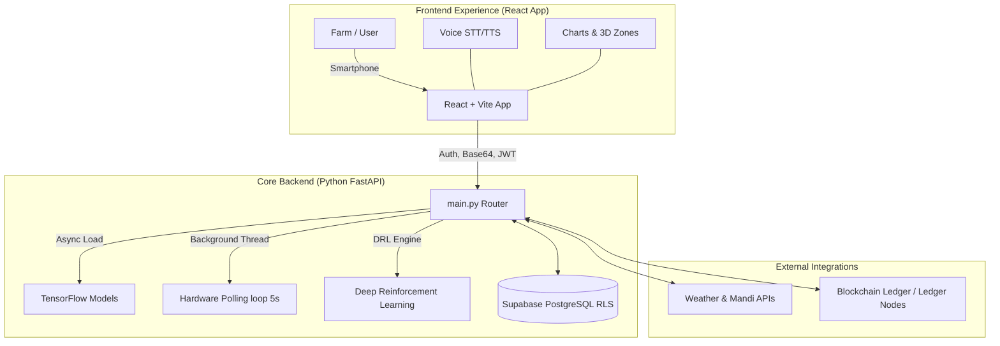

# 🌾 Annadata Saathi (Let Go 3.0)
## *Multi-Agent Precision Agriculture System Leveraging AI, DRL & IoT*

---


## 📌 Project Resources
- **📁 [Project Drive Link (Assets & Info)](https://drive.google.com/drive/folders/1621AS4paJHEzM6xfE4wstdHwvK2Dqyc0?usp=drive_link)**

---

## 📌 Project Overview
**Annadata Saathi (Let Go 3.0)** is an advanced, **Multi-Agent Precision Agriculture System** designed to support small and marginal farmers. It bridges the digital divide by transforming complex agricultural data into actionable guidance, helping farmers improve productivity, sustainability, and transparency.

The platform orchestrates a **React Frontend Application** offering real-time intelligence natively and a high-performance **Python FastAPI Backend** that operates complex heavy machine learning models, deep reinforcement learning (DRL) logic, and background IoT sensor polling.

---

## 🛑 The Challenge
Small and marginal farmers face a "triple threat" of uncertainty:
1. **Environmental Vulnerability**: Unpredictable weather and inefficient resource usage.
2. **Information Inaccessibility**: Delayed detection of crop diseases and lack of real-time market/mandi prices.
3. **Digital Divide**: Limited internet connectivity in rural areas and complex interfaces for government schemes.

---

## 💡 Our Solution: End-to-End Precision Agriculture Ecosystem

### 📱 1. Frontend Experience (React Application)
- **Built with React & Vite**: A lightning-fast web application designed for high interactivity. It transmits user states, JWT tokens, array datasets, and base64 imagery directly to the core backend.
- **Stunning UI/UX**: Utilizes **Tailwind CSS**, **Framer Motion**, and **GSAP** for fluid interfaces. It dynamically renders charts, weather cards, soil health statistics, and complex 3D farm zones.
- **Multilingual Support & Voice Access**: Reaches farmers across varying literacy levels using embedded text-to-speech technologies.

### ⚙️ 2. Core Backend (Python FastAPI & Supabase)
- **FastAPI Core (`main.py`)**: A highly modularized architecture routing requests to distinct feature folders.
- **Asynchronous Model Loading**: Prevents server worker timeouts on first requests by loading massive TensorFlow machine learning models asynchronously upon server startup via background threads (`@app.on_event("startup")`).
- **Data Isolation & Security**: Powered by **Supabase (PostgreSQL)** implementing Row Level Security (RLS) to enforce strict user data isolation based strictly on `user_id`.
- **Background Sensor Polling**: Continuously pulls hardware metrics (Fire/Gas) without blocking the main event loop.

---

## 🚀 10+ Integrated Smart Features & Backend Mapping
Our repository is strictly modularized into distinct "features", combining robust backend logic with interactive frontend JSX components effortlessly:

1. **Deep Reinforcement Learning (DRL) Recommendations (`feature4_drl`)**: Powers the core crop recommendation engine. It makes dynamic decisions on optimal crop placement based on strict environmental parameters utilizing robust pure DRL algorithms.
2. **AI Crop Health & Disease Prediction (`feature2`, `DecisionIntelligence.jsx`)**: Instant crop disease prediction. The backend evaluates leaf damage entirely on-device via asynchronously loaded TensorFlow models and returns localized treatment remedies over FastAPI.
3. **Smart Equipment Analyzer (`feature5`, `EquipmentAnalyzer.jsx`)**: An orchestration engine that utilizes computer vision on uploaded equipment images to calculate type, age, health score (0-100), and repair estimates. It auto-generates a 6-month maintenance schedule, suggests repair kits from the marketplace, and calculates available agricultural subsidies securely.
4. **IoT Warehouse & Field Safety (`feature7 & hardware`, `ModernFarmerDashboard.jsx`)**: Hardware IoT service running an infinite loop (`start_fire_gas_polling`) checking for spikes in Fire/Gas sensor data every 5 seconds. Pushes real-time metrics back to the frontend dashboards alongside NPK and soil moisture telemetry.
5. **Blockchain Farm Vault (`feature6`, `FarmerInventory.jsx`)**: Manages harvested agricultural assets securely. Handles all logic for blockchain transactions related to inventory tracking to prevent supply chain fraud, creating verifiable Digital Passports with unique Scannable QR Codes.
6. **Intelligent Farmer Agent (`feature4`, `SchemesAgent.jsx`)**: "Kisan Sahayak", an AI persona that tracks farmer profiles, provides contextual conversational assistance, and helps users seamlessly understand and apply for government subsidies.
7. **Market Intelligence & Direct Marketplace (`mandi`, `ModernMarketplace.jsx`)**: Fetches massive external datasets to deliver real-time mandi prices across different regions combined with a direct-from-farm marketplace.
8. **Disaster Alerts & Agricultural News (`feature_news`)**: Filters the internet for hyper-local agricultural updates, disaster warnings, and specific farming tips natively embedded in UI modules.
9. **Dual Authentication System (`auth` & `face_auth`, `FaceAuth.jsx`)**: A hybrid system merging standard JWT-based login with localized, extremely secure **Facial Recognition**. Eliminates complex password struggles for less digitally literate users.
10. **Smart Irrigation Controls**: Automated watering recommendations based on real-time soil data and predictive weather APIs.
11. **Supply Chain Traceability (`ProductTransparency.jsx`)**: End-to-end event traceability logging actions like `SENSOR_READING` and `IRRIGATION` events to entirely guarantee product origin records.

---

## 🏗️ System Architecture



---

## 🛠️ Technology Stack

| Layer | Technologies |
| :--- | :--- |
| **Frontend UI** | React.js, Vite, Framer Motion, GSAP, Tailwind CSS |
| **Backend Framework** | Python FastAPI (`main.py`), Modular Feature Routing |
| **AI / Machine Learning** | TensorFlow (Async Loading), Deep Reinforcement Learning (DRL) |
| **Hardware / IoT** | Custom continuous infinite polling scripts (Fire, Gas, NPK, Moisture) |
| **Database & Security** | PostgreSQL, Supabase (RLS user_id isolation), FaceAuth algorithms |
| **External APIs** | OpenWeatherMap, Mandi APIs, News Parsers, Blockchain Networks |

---

## 🚀 Getting Started

### Prerequisites
- Python (v3.9+)
- Node.js (v18+)
- Postgres/Supabase configured (check `.env`)
- Git

### Installation
1. **Clone the repository**
   ```bash
   git clone https://github.com/DHRUV-SAVE21/Let_Go_3.0.git
   cd Let_Go_3.0
   ```

2. **Backend Setup (FastAPI)**
   ```bash
   cd backend
   pip install -r requirements.txt
   uvicorn main:app --reload
   ```
   *The background threads (TensorFlow loading & IoT polling) will automatically spin up rapidly on startup.*

3. **Frontend Setup & Start (React App)**
   In a separate terminal:
   ```bash
   cd frontend
   npm install
   npm run dev
   ```
   *Visit `http://localhost:5173` to see the extremely robust application in action.*

---

## 👥 Meet the Team
**College**: Veermata Jijabai Technological Institute (VJTI), Mumbai

| Member | Focus |
| :--- | :--- |
| **Dhruv Save** | Team Lead |
| **Megh Bari** | AI/ML & Computer Vision |
| **Kavya Zala** | Frontend & UI/UX |
| **Neelay Joshi** | Architecture & Integration |

---
*Made with ❤️ for the Indian Farmer.*
